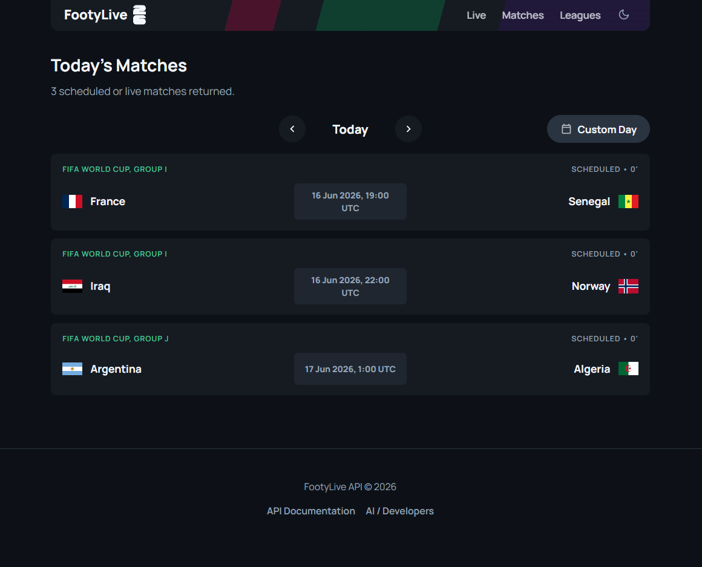
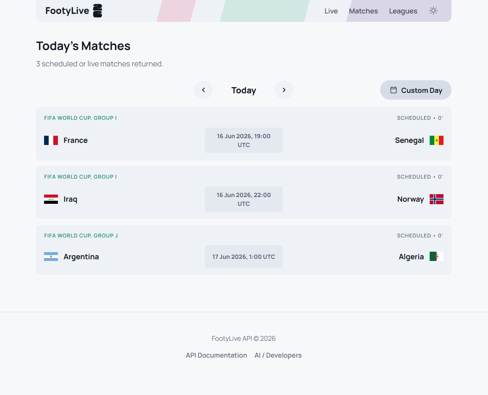
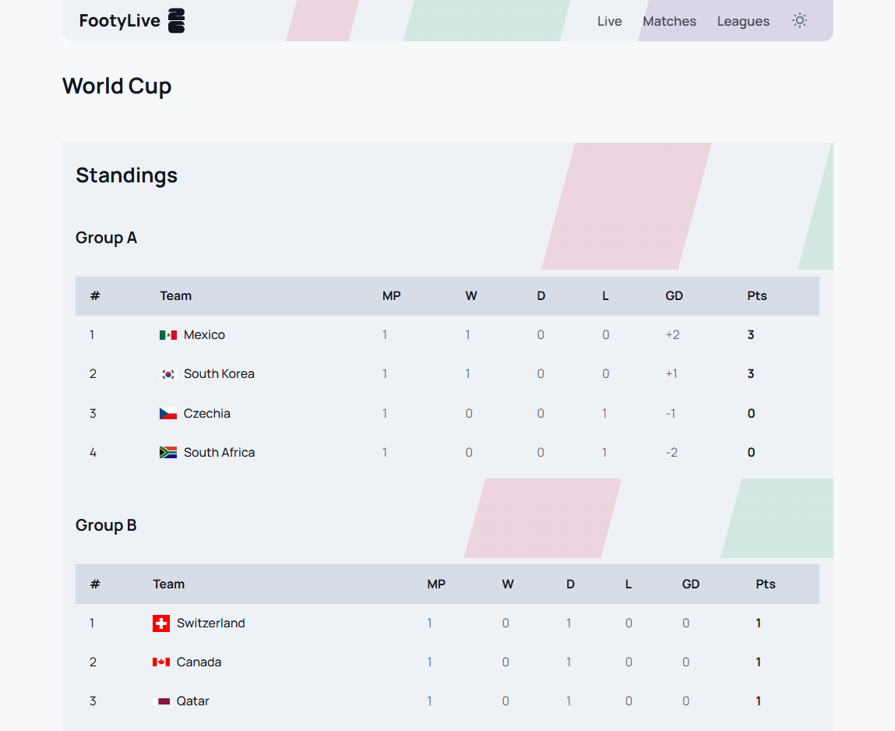

<div align="center">
  <h1>⚽ FootyLive API & Web App</h1>
  <p>
    <b>A high-performance, open-source proxy for live sports data built with FastAPI.</b>
  </p>

  [](https://opensource.org/licenses/MIT)
  [](https://www.python.org/downloads/)
  [](https://fastapi.tiangolo.com/)

  <br />
</div>

## 📸 Screenshots

<div align="center">
  
  
  
</div>

---

## 🌟 Features

- ⚡ **Live Match Tracking**: Real-time score updates, live events ticker, and match minute tracking.
- 🧠 **Intelligent Caching**: Custom in-memory TTLCache mechanism to drastically reduce outbound network requests during high concurrency.
- 🌍 **Public API**: Open for all developers, protected by a global rate limit of 100 requests per second.
- 🎨 **Responsive Design**: Custom CSS framework with a sleek glassmorphism aesthetic and seamless dark/light mode toggle.
- 🚀 **Production Ready**: Pre-configured for instant deployment on Render using Infrastructure as Code (`render.yaml`).

## 🛠 Tech Stack

- **Backend**: FastAPI, Python 3.10+
- **Frontend**: HTML5, CSS3, Jinja2 Templates
- **Networking**: HTTPX
- **Data Source**: ESPN Soccer API

## 🏆 Supported Leagues & Competitions
- **Domestic Leagues**: Premier League (`eng.1`), LALIGA (`esp.1`), Serie A (`ita.1`), Bundesliga (`ger.1`), Ligue 1 (`fra.1`)
- **Continental Clubs**: Champions League (`uefa.champions`), Europa League (`uefa.europa`)
- **International**: World Cup (`fifa.world`), Euros (`uefa.euro`), Copa América (`conmebol.america`), AFCON (`caf.nations`), Asian Cup (`afc.asian`)
- **Domestic Cups**: FA Cup (`eng.fa`), Copa del Rey (`esp.copa_del_rey`), Coppa Italia (`ita.coppa_italia`), DFB-Pokal (`ger.dfb_pokal`), Coupe de France (`fra.coupe_de_france`)

## 💻 Local Development

### 1. Install Dependencies
Ensure you have Python installed. Create a virtual environment and install the required packages:

```bash
python -m venv .venv
# On Windows use: .venv\Scripts\activate
# On Mac/Linux use: source .venv/bin/activate
pip install -r requirements.txt
```

### 2. Run the Server
You can start the local development server using uvicorn:

```bash
uvicorn app.main:app --reload --port 8000
```

The application will be available at [http://localhost:8000](http://localhost:8000).

## ☁️ Deployment

This project is configured to be deployed automatically to Render.com.

1. Push this repository to GitHub.
2. Create an account on Render.com.
3. Click **New** -> **Blueprint**.
4. Select your GitHub repository.
5. Render will automatically provision the environment, install dependencies, and start the application using the configuration provided in `render.yaml`.

## 📜 Open Source & Licensing

This project is completely free to use and open-source under the **MIT License**. You have the absolute right to use, modify, and distribute this code in your own personal or commercial projects. See the `LICENSE` file for more details.
